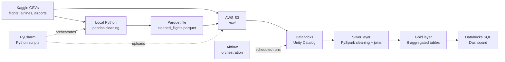

# Architecture

## End-to-End Pipeline

## Layer-by-Layer Explanation

### 1. Ingestion (Local → S3)

- **Source:** Kaggle "2015 Flight Delays and Cancellations"
- **Raw files:** `flights.csv` (5.8M rows), `airlines.csv` (14 rows), `airports.csv` (322 rows)
- **Local cleaning:** pandas script (`src/clean_data.py`) produces a Parquet file
- **Cloud upload:** boto3 script (`src/upload_to_s3.py`) pushes raw CSVs and cleaned Parquet to S3

### 2. Bronze / Raw (S3 + Unity Catalog)

- Raw CSVs uploaded to `s3://.../raw/`
- Cleaned Parquet to `s3://.../silver/`
- In Databricks: raw files ingested as Delta tables: `raw_flights`, `airlines`, `airports`

### 3. Silver (Databricks / PySpark)

- **Notebook:** `02_silver_layer`
- **Output table:** `silver_flights` (5.3M rows × 32 cols)
- **Operations:**
  - Drop unused columns
  - Build `FLIGHT_DATE` from YEAR/MONTH/DAY
  - Cast flags to boolean
  - Map cancellation codes to text
  - Join airlines → `AIRLINE_NAME`
  - Join airports (origin + destination) → city, state
  - Filter unresolvable airport codes

### 4. Gold (Databricks / PySpark)

- **Notebook:** `03_gold_layer`
- **6 aggregated Delta tables:**

| Table | Business question |
|-------|-------------------|
| `gold_airline_performance` | Which airlines are on time? |
| `gold_airport_traffic` | Which airports are busiest? |
| `gold_monthly_delays` | Which months have worst delays? |
| `gold_cancellation_reasons` | Why are flights cancelled? |
| `gold_route_performance` | Worst origin → destination routes? |
| `gold_hourly_delays` | Which hour of day is worst? |

### 5. Presentation (Databricks SQL)

- Dashboard with 11 widgets: 4 KPIs + 6 charts + 1 map
- Screenshots stored in `docs/screenshots/`

### 6. Orchestration (Airflow — planned)

- DAG will trigger the entire pipeline on a schedule
- Databricks notebooks invoked via REST API

## Tech Stack

| Layer | Tool |
|-------|------|
| IDE | PyCharm |
| Data manipulation (local) | pandas |
| Data manipulation (cloud) | PySpark |
| Storage | AWS S3 |
| Compute | Databricks (Serverless) |
| Storage format | Delta Lake |
| Catalog | Unity Catalog |
| Dashboard | Databricks SQL |
| Orchestration | Airflow (planned) |
| Version control | Git + GitHub |